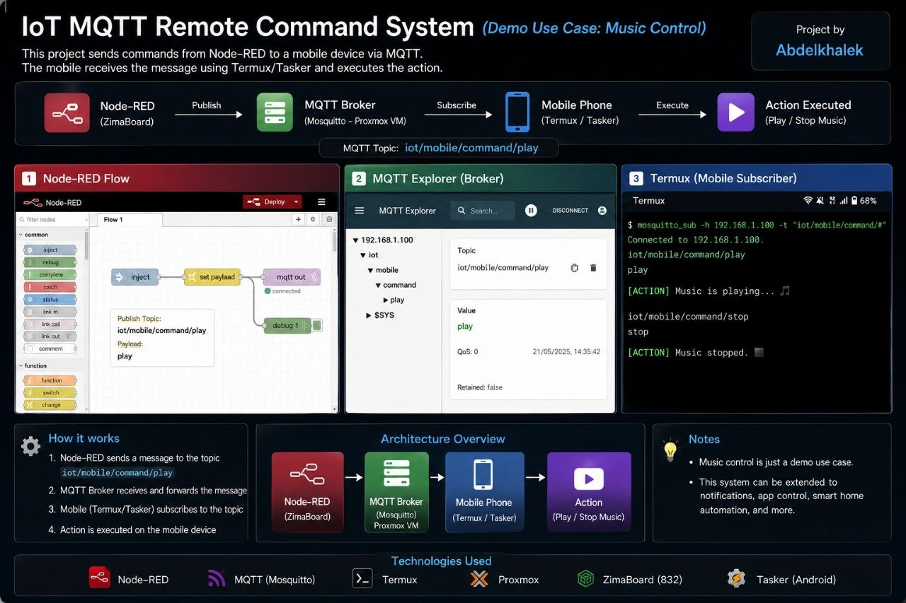
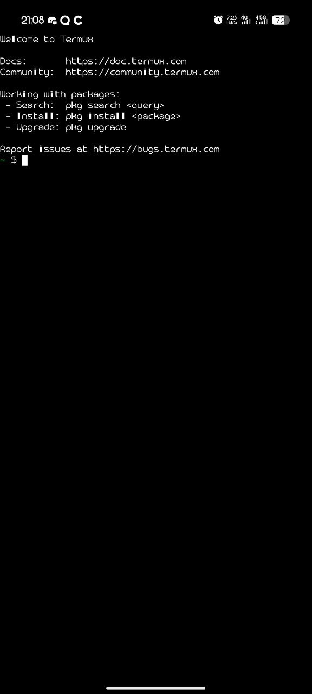

# IoT MQTT Command System

> Real-time remote device control via **Node-RED → Mosquitto → Tasker/Termux**


---

## What Is This?

This project implements a real-time IoT command pipeline that lets you send commands from a Node-RED dashboard to any Android device — instantly, over MQTT.

The demo use case is music control, but the system is **fully generic**: any command you can script in Termux or automate in Tasker can be triggered remotely. Notifications, app launching, smart home actions, remote shell execution — all fair game.

---

## Architecture

```
┌─────────────────────────┐
│  Node-RED Dashboard     │  ← Runs on ZimaBoard 832
│  (Command Sender)       │
└──────────┬──────────────┘
           │ MQTT Publish
           ▼
┌─────────────────────────┐
│  Mosquitto MQTT Broker  │  ← Runs on Proxmox VE (LXC container)
└──────────┬──────────────┘
           │ MQTT Subscribe
           ▼
┌─────────────────────────┐
│  Android Device         │  ← Tasker listens for MQTT topic
│  Tasker + Termux        │     Termux executes the shell command
└─────────────────────────┘
           │
           ▼
     Action Executed
```



---

## Tech Stack

| Layer | Tool | Role |
|---|---|---|
| Flow Automation | Node-RED | Build and send MQTT commands via UI |
| Message Broker | Mosquitto | Route MQTT messages between publisher and subscriber |
| Server Hardware | ZimaBoard 832 | Hosts Node-RED |
| Virtualization | Proxmox VE | Hosts Mosquitto in an LXC container |
| Android Automation | Tasker | Listens for MQTT topics, triggers actions |
| Terminal Emulator | Termux | Executes shell commands on Android |
| Monitoring | MQTT Explorer | Debug and inspect MQTT messages live |

---

## MQTT Topics

```
iot/mobile/command/play      →  Start audio playback
iot/mobile/command/stop      →  Stop audio playback
iot/mobile/command/notify    →  Send a notification
```

Topics follow the pattern: `iot/mobile/command/<action>`

You can extend this to any command you can script:
- `iot/mobile/command/screenshot`
- `iot/mobile/command/reboot`
- `iot/mobile/command/open_camera`

---

## Setup

### 1. MQTT Broker — Mosquitto on Proxmox

```bash
# Inside your Proxmox LXC container (Debian/Ubuntu)
apt update && apt install -y mosquitto mosquitto-clients

# Allow anonymous connections for local testing
echo "allow_anonymous true" >> /etc/mosquitto/mosquitto.conf
echo "listener 1883" >> /etc/mosquitto/mosquitto.conf

systemctl enable mosquitto
systemctl start mosquitto
```

> For production: enable authentication with `password_file` in `mosquitto.conf`.

---

### 2. Node-RED Flow

1. Install Node-RED on your ZimaBoard:
   ```bash
   npm install -g --unsafe-perm node-red
   node-red
   ```
2. Open Node-RED at `http://<zimaboard-ip>:1880`
3. Drag in an **Inject** node → **MQTT Out** node
4. Set the broker address to your Proxmox machine's IP, port `1883`
5. Set topic to `iot/mobile/command/play`
6. Deploy and click inject to test

---

### 3. Android — Tasker + Termux

**Termux setup:**
```bash
pkg update && pkg install -y mosquitto

# Subscribe to all command topics
mosquitto_sub -h <BROKER_IP> -t "iot/mobile/command/#" -v
```

**Tasker setup:**
1. Install [Tasker](https://play.google.com/store/apps/details?id=net.dinglisch.android.taskerm) and grant necessary permissions
2. Create a new **Profile → Event → Plugin → MQTT**
3. Link it to a **Task** that runs a Termux command:
   ```
   Action: Termux → Run Command
   Command: am start -a android.intent.action.VIEW ...
   ```
4. Save and activate the profile

---

## Screenshots

**Node-RED Flow**


**MQTT Explorer — Live Messages**


**Termux Subscriber Output**



---

## Extending the System

The command system is not tied to music control. You can adapt it to:

- **Smart home** — trigger lights, fans, or relays via GPIO or HTTP
- **Notifications** — push custom alerts to your phone from any script
- **Remote shell** — execute arbitrary Termux commands from Node-RED
- **App control** — launch or close Android apps via `am start`
- **Monitoring** — have the phone publish sensor data back to the broker

---

## License

MIT — see [LICENSE](LICENSE)

---

*Part of my IoT & embedded systems learning journey — built with a ZimaBoard, Proxmox, and a phone that became a smart endpoint.*
